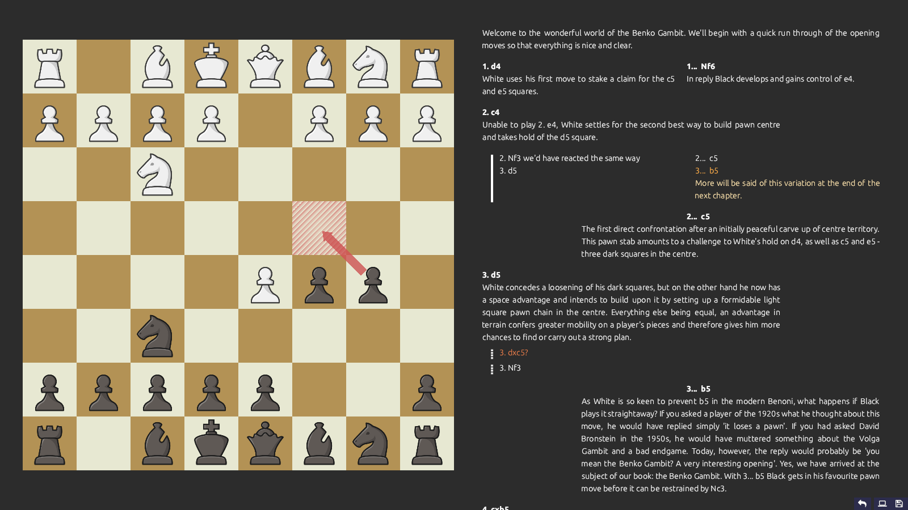

# SloubiChess

**SloubiChess** is a chess database program with focus on:
- *variations* made to look *good* and *readable*, as most chess desktop apps are ugly ;
- *training* by repeating your lines (next big feature, not yet implemented).


<p align="center">
<em>alpha-0.0.5</em>
</p>

It is **not** (and probably won't ever be):
- a database store of all GMs games ;
- a chess engine, nor a way to interface with chess engines ;
- a way to play chess against someone or something.

## Download

Check the [Releases](https://github.com/Breush/sloubi-chess/releases) for your platform. We provide Linux and Windows 64 bits binaries.

## Compile and ship

```bash
jai ./src/first.jai         # Generate the binary in bin/
jai ./src/first.jai -- ship # Create a release package for the current platform in releases/
```

## Usage

```bash
./bin/sloubi-chess
./bin/sloubi-chess -pgn <PGN_FILE>
```
